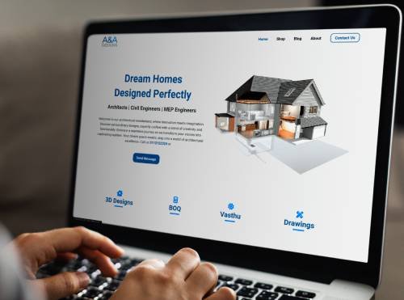
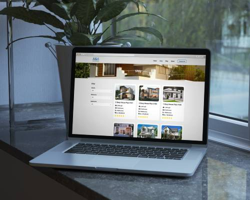
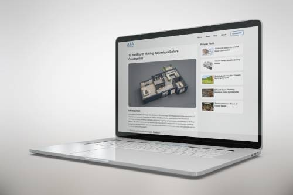
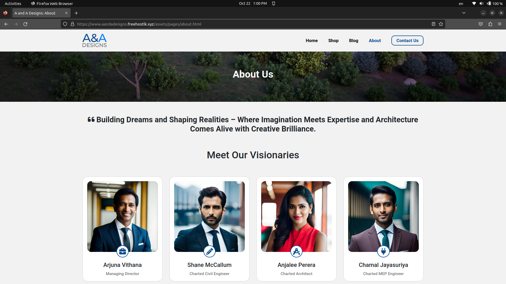

# Website Design For Architectural Company

### Version
0.1.0

### License
Copyright &copy; 2023 Shehan Rathnayake. All Rights Reserved. 
This project is licensed under [MIT License](License.txt).

## Introduction

In this project I have aimed to build an official website for an architectural company as their main website representing them in the digital world. The primary goal of this project is to design a comprehensive website showcasing the company's portfolio and other architectural services provided by them.

## Technologies Used

- HTML5
- CSS3
- Bootstrap5
- JavaScript
- jQuery
- Figma

## Supported Links

- [Hosted Website](https://www.aandadesigns.freehostlk.xyz/) 👈
- [Project Story on Medium](https://medium.com/@shehan_rathnayake/from-code-to-canvas-a-web-design-project-for-an-architectural-company-763a2693c547) 👈

## Sample Images

### Support :

***If you like what I do, maybe consider buying me a coffee*** 🥺 👇

  